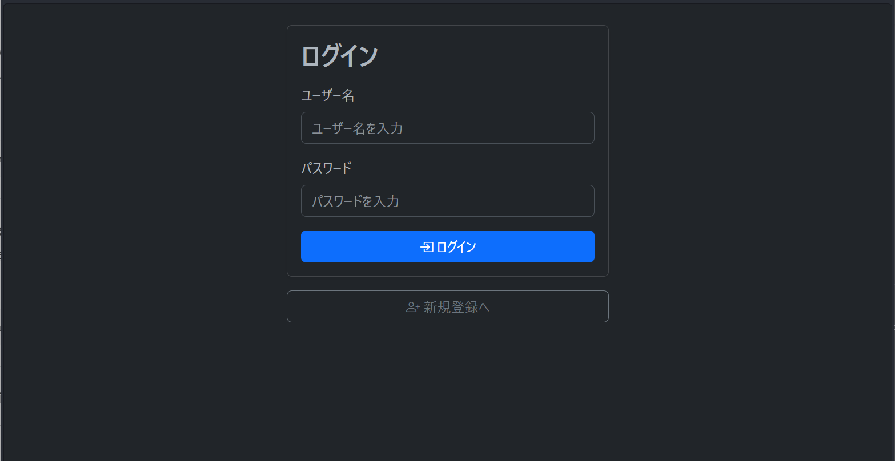
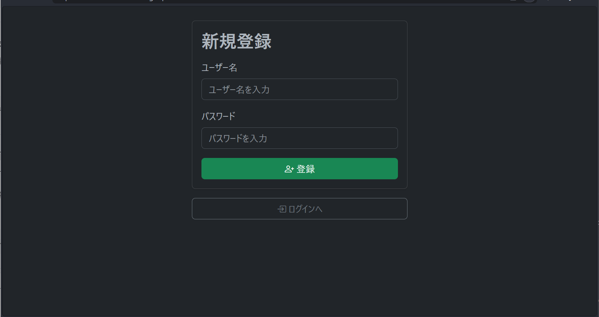
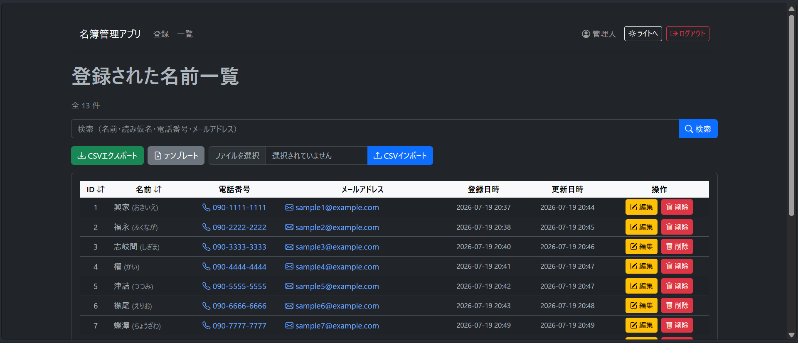
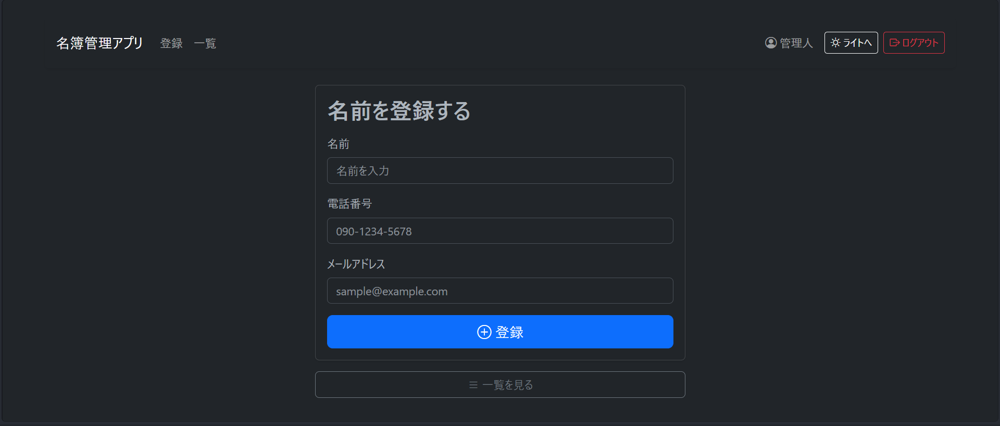
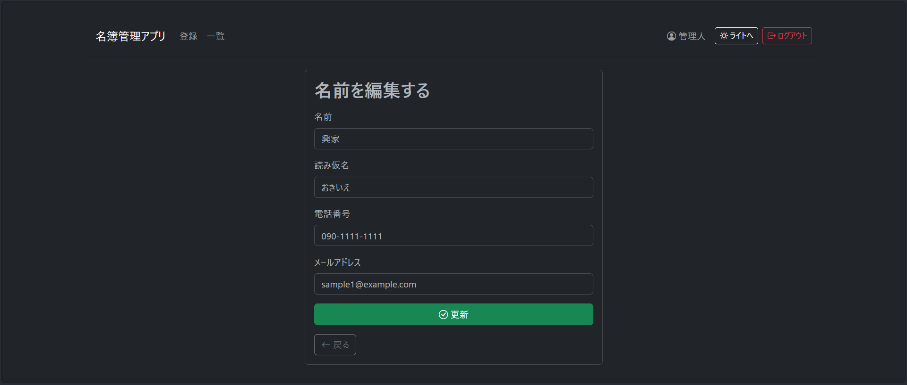

# 名簿管理アプリ

Flaskを使用して開発した名簿管理Webアプリです。

ユーザー認証機能を備え、名簿の登録・編集・削除（CRUD）、検索、並び替え、ページネーション、CSVインポート・エクスポートなど、業務で利用されることの多い機能を実装しています。

---

## 主な機能

* ユーザー登録
* ログイン / ログアウト
* 名簿の登録・編集・削除（CRUD）
* 名前・読み仮名・電話番号・メールアドレスによる検索
* ID・名前による昇順・降順の並び替え
* ページネーション
* CSVインポート
* CSVエクスポート
* CSVテンプレートのダウンロード
* 読み仮名の自動生成
* 電話番号の自動整形
* ダークモード / ライトモード切り替え

---

## 使用技術

| 分類      | 技術                                         |
| ------- | ------------------------------------------ |
| 言語      | Python 3.14                                   |
| フレームワーク | Flask                                      |
| 認証      | Flask-Login                                |
| セキュリティ  | Flask-WTF（CSRF対策）                          |
| データベース  | SQLite                                     |
| フロントエンド | HTML / CSS / Bootstrap 5 / Bootstrap Icons |
| 日本語処理   | fugashi / jaconv                           |

---

## ディレクトリ構成

```text
member-management-app/
│
├── app.py
├── auth.py
├── members.py
├── csv_routes.py
├── config.py
├── database.py
├── models.py
├── utils.py
├── requirements.txt
├── README.md
│
├── templates/
│   ├── base.html
│   ├── login.html
│   ├── signup.html
│   ├── list.html
│   ├── add.html
│   └── edit.html
│
└── static/
```

---

## セットアップ

### 1. リポジトリをクローン

```bash
git clone https://github.com/chatora0330/member-management-app.git
cd member-management-app
```

### 2. 仮想環境を作成（推奨）

**Windows**

```bash
python -m venv .venv
.venv\Scripts\activate
```

**macOS / Linux**

```bash
python3 -m venv .venv
source .venv/bin/activate
```

### 3. 必要なライブラリをインストール

```bash
pip install -r requirements.txt
```

### 4. 環境変数を設定

`.env` ファイル、または環境変数に以下を設定してください。

```text
SECRET_KEY=任意のランダムな文字列
FLASK_DEBUG=0
```

### 5. アプリを起動

```bash
python app.py
```

ブラウザで以下にアクセスしてください。

```text
http://127.0.0.1:5000
```

---
## スクリーンショット

### ログイン画面



### 新規登録画面



### 一覧画面



### 登録画面



### 編集画面



---

## 工夫した点

* Flask Blueprintによる機能ごとの分割
* Flask-Loginによる認証機能
* Flask-WTFによるCSRF対策
* SQLiteのプレースホルダを利用したSQLインジェクション対策
* Bootstrapを利用したレスポンシブ対応
* CSVインポート・エクスポート機能の実装
* 名前の読み仮名を自動生成、及び編集機能を実装
* 電話番号の入力フォーマットを自動整形
* ダークモード / ライトモードの切り替え機能
* 検索・並び替え・ページネーションによる使いやすい一覧画面

---

## 今後の改善予定

* 入力値バリデーションの強化
* テストコードの追加
* Docker対応
* クラウド環境へのデプロイ
* 管理者権限機能の追加
* CSVインポート時のエラー内容の詳細表示

---

## ライセンス

このプロジェクトは、Python・Flaskの学習およびポートフォリオとして作成したものです。
